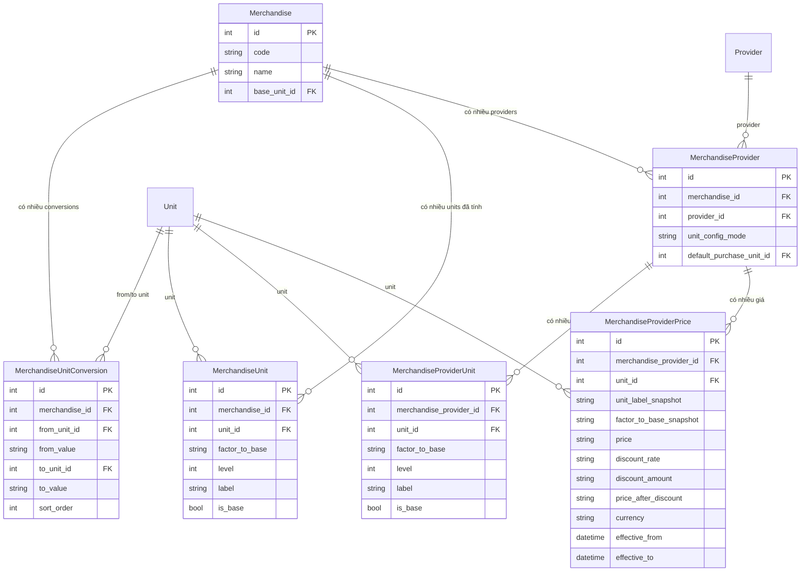
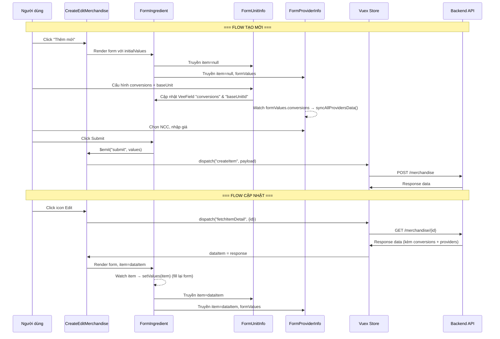
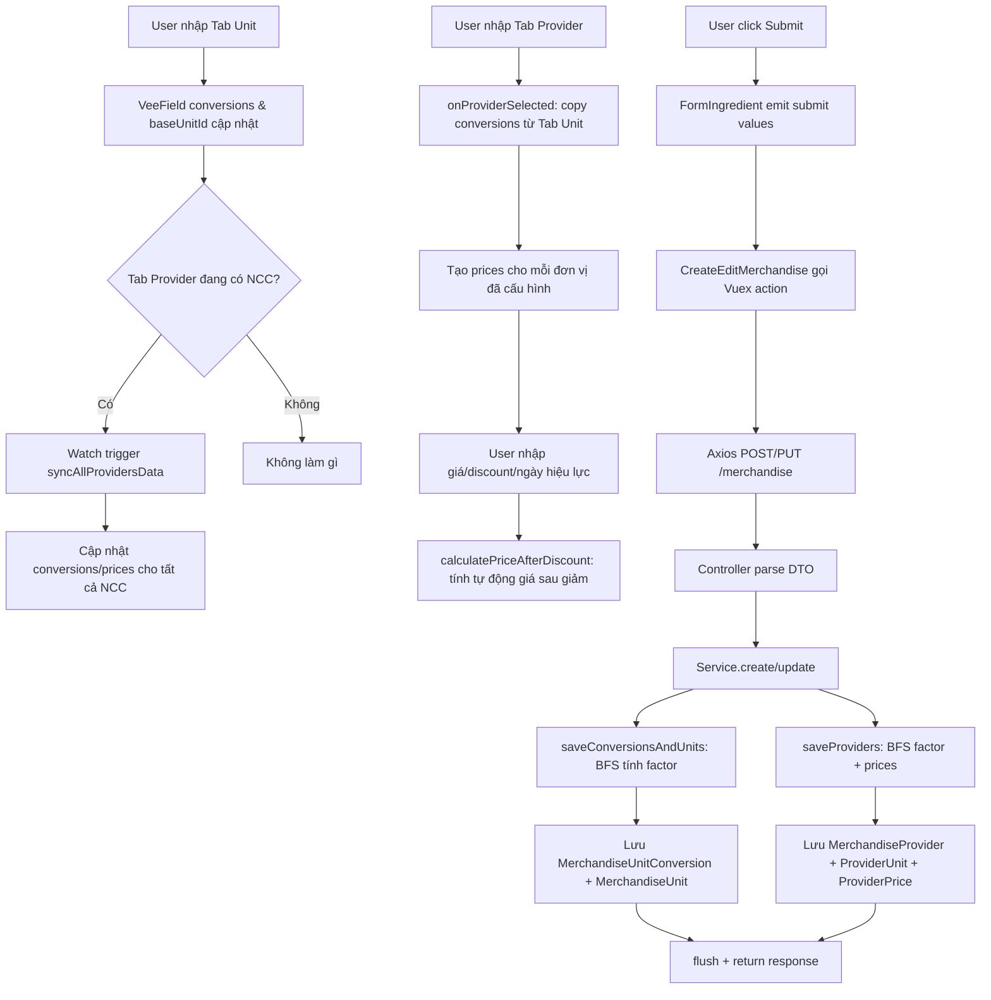

# Giải Thích Chi Tiết Luồng Xử Lý Tab Unit & Tab Provider

> [!NOTE]
> Tài liệu này giải thích **đầy đủ flow xử lý** cho 2 chức năng trong [FormIngredient.vue](file:///media/huybach/DATA/CODE/SYMFONY/boilerplate/admin/src/pages/Merchandise/FormIngredient.vue#L29-L35):
> - **Tab Unit** (`FormUnitInfo`) - Cấu hình đơn vị quy đổi
> - **Tab Provider** (`FormProviderInfo`) - Cấu hình nhà cung cấp

---

## Sơ Đồ Database Entities



---

# PHẦN 1: BACKEND (Symfony)

---

## 1.1. Entity & DTO Layer

### DTO nhận request từ FE

Khi FE submit form, toàn bộ data được gửi qua HTTP request và Symfony tự động map vào [MerchandiseDTO](file:///media/huybach/DATA/CODE/SYMFONY/boilerplate/src/DTO/MerchandiseDTO.php):

```php
class MerchandiseDTO
{
    public function __construct(
        public readonly ?string $code = null,
        public readonly ?string $name = null,
        public readonly ?int $categoryId = null,
        public readonly ?string $type = null,
        // ... các field khác
        public readonly ?int $baseUnitId = null,       // ← Đơn vị cơ sở (từ Tab Unit)
        public readonly ?array $conversions = null,     // ← Mảng các quy đổi (từ Tab Unit)
        public readonly ?array $providers = null,       // ← Mảng nhà cung cấp (từ Tab Provider)
    ) {}
}
```

**Ví dụ data mẫu JSON gửi lên BE:**

```json
{
  "code": "NL001",
  "name": "Bột mì",
  "type": "ingredient",
  "categoryId": 5,
  "status": 1,
  "baseUnitId": 3,
  "conversions": [
    {
      "fromUnitId": 1,
      "fromValue": 1,
      "toUnitId": 3,
      "toValue": 24,
      "sortOrder": 0
    },
    {
      "fromUnitId": 2,
      "fromValue": 1,
      "toUnitId": 3,
      "toValue": 6,
      "sortOrder": 1
    }
  ],
  "providers": [
    {
      "providerId": 10,
      "unitConfigMode": "custom",
      "defaultPurchaseUnitId": 1,
      "conversions": [
        {
          "fromUnitId": 1,
          "fromValue": 1,
          "toUnitId": 3,
          "toValue": 24
        },
        {
          "fromUnitId": 2,
          "fromValue": 1,
          "toUnitId": 3,
          "toValue": 6
        }
      ],
      "prices": [
        {
          "unitId": 1,
          "price": 500000,
          "discountRate": "5.00",
          "discountAmount": "0.00",
          "priceAfterDiscount": "475000.00",
          "effectiveFrom": "2026-01-01",
          "effectiveTo": "2026-12-31"
        },
        {
          "unitId": 2,
          "price": 130000,
          "discountRate": "0.00",
          "discountAmount": "10000.00",
          "priceAfterDiscount": "120000.00",
          "effectiveFrom": null,
          "effectiveTo": null
        },
        {
          "unitId": 3,
          "price": 22000,
          "discountRate": "0.00",
          "discountAmount": "0.00",
          "priceAfterDiscount": "22000.00",
          "effectiveFrom": null,
          "effectiveTo": null
        }
      ]
    }
  ]
}
```

> **Giả sử:**
> - Unit `id=1` → "Thùng"
> - Unit `id=2` → "Lốc"  
> - Unit `id=3` → "Chai" (đơn vị cơ sở)
> - Provider `id=10` → "NCC Bột Mì ABC"

---

### Các Entity liên quan

| Entity | Mô tả | File |
|---|---|---|
| [Merchandise](file:///media/huybach/DATA/CODE/SYMFONY/boilerplate/src/Entity/Merchandise.php) | Hàng hóa chính, có field `baseUnit` | Entity chính |
| [MerchandiseUnitConversion](file:///media/huybach/DATA/CODE/SYMFONY/boilerplate/src/Entity/MerchandiseUnitConversion.php) | Lưu từng dòng quy đổi (`1 Thùng = 24 Chai`) | Quy đổi gốc |
| [MerchandiseUnit](file:///media/huybach/DATA/CODE/SYMFONY/boilerplate/src/Entity/MerchandiseUnit.php) | Kết quả tính toán: mỗi unit có `factorToBase`, `level`, `label` | Đơn vị đã tính |
| [MerchandiseProvider](file:///media/huybach/DATA/CODE/SYMFONY/boilerplate/src/Entity/MerchandiseProvider.php) | Liên kết merchandise ↔ provider | Nhà cung cấp |
| [MerchandiseProviderUnit](file:///media/huybach/DATA/CODE/SYMFONY/boilerplate/src/Entity/MerchandiseProviderUnit.php) | Factor riêng cho từng provider (tương tự `MerchandiseUnit`) | Đơn vị NCC |
| [MerchandiseProviderPrice](file:///media/huybach/DATA/CODE/SYMFONY/boilerplate/src/Entity/MerchandiseProviderPrice.php) | Giá mua theo từng đơn vị cho từng NCC | Giá NCC |

---

## 1.2. Controller Layer

[MerchandiseController](file:///media/huybach/DATA/CODE/SYMFONY/boilerplate/src/Controller/MerchandiseController.php) chỉ làm 2 việc: parse request & gọi Service.

### Flow POST (Create)

```php
#[Route('/merchandise', methods: ['POST'])]
public function create(
    #[MapRequestPayload(validationGroups: ['create'])] MerchandiseDTO $merchandiseDTO
): JsonResponse {
    // Symfony tự động:
    // 1. Parse JSON body → map vào MerchandiseDTO
    // 2. Validate theo groups: ['create']
    // 3. Nếu pass → gọi service
    $data = $this->merchandiseService->create($merchandiseDTO);
    return CustomResponse::success($data, t('success.created'));
}
```

### Flow PUT (Update)

```php
#[Route('/merchandise/{id}', methods: ['PUT'])]
public function update(
    int $id,
    #[MapRequestPayload(validationGroups: ['update'])] MerchandiseDTO $merchandiseDTO
): JsonResponse {
    $data = $this->merchandiseService->update($id, $merchandiseDTO);
    return CustomResponse::success($data, t('success.updated'));
}
```

### Flow GET Detail (Lấy data để hiển thị form update)

```php
#[Route('/merchandise/{id}', methods: ['GET'], priority: -1)]
public function getOne(int $id): JsonResponse {
    $data = $this->merchandiseService->findById($id);
    return CustomResponse::success($data);
}
```

---

## 1.3. Service Layer - CHI TIẾT TỪNG BƯỚC

Toàn bộ logic nằm trong [MerchandiseService](file:///media/huybach/DATA/CODE/SYMFONY/boilerplate/src/Service/MerchandiseService.php).

---

### 1.3.1. FLOW: `create()` — Tạo mới Merchandise

```php
public function create(MerchandiseDTO $dto): array
{
    // BƯỚC 1: Tạo entity Merchandise
    $item = new Merchandise();
    $item->setCode($dto->code);       // "NL001"
    $item->setName($dto->name);       // "Bột mì"
    $item->setType($dto->type);       // "ingredient"
    // ... set các field khác

    // BƯỚC 2: Set base unit
    if ($dto->baseUnitId) {
        $baseUnit = $this->entityManager->getRepository(Unit::class)->find($dto->baseUnitId);
        // find(3) → Unit "Chai"
        $item->setBaseUnit($baseUnit);
    }

    $this->entityManager->persist($item);

    // BƯỚC 3: Xử lý Tab Unit → saveConversionsAndUnits()
    if ($dto->baseUnitId || !empty($dto->conversions)) {
        $this->saveConversionsAndUnits($item, $dto->conversions, $dto->baseUnitId);
    }

    // BƯỚC 4: Xử lý Tab Provider → saveProviders()
    if (!empty($dto->providers)) {
        $this->saveProviders($item, $dto->providers);
    }

    // BƯỚC 5: Flush tất cả vào DB
    $this->entityManager->flush();

    // BƯỚC 6: Trả về data đã format
    $data = $item->jsonSerialize();
    $data['conversions'] = $this->getConversionsData($item->getId());
    $data['providers'] = $this->getProvidersData($item->getId());

    return $data;
}
```

---

### 1.3.2. FLOW: `saveConversionsAndUnits()` — Xử lý Tab Unit

> [!IMPORTANT]
> Đây là core logic của Tab Unit. Method này có 2 nhiệm vụ:
> 1. Lưu các `MerchandiseUnitConversion` (dữ liệu raw từ form)
> 2. Tính toán `factorToBase` bằng **thuật toán BFS** và lưu `MerchandiseUnit`

```php
public function saveConversionsAndUnits(
    Merchandise $merchandise,
    ?array $conversionsData,
    ?int $baseUnitId
): void {
```

#### Bước 1: Xóa data cũ (strategy "delete-all → re-create")

```php
// Xóa toàn bộ MerchandiseUnitConversion cũ
$oldConversions = $conversionRepo->findBy(['merchandise' => $merchandise]);
foreach ($oldConversions as $oldC) {
    $this->entityManager->remove($oldC);
}

// Xóa toàn bộ MerchandiseUnit cũ
$oldUnits = $merchandiseUnitRepo->findBy(['merchandise' => $merchandise]);
foreach ($oldUnits as $oldU) {
    $this->entityManager->remove($oldU);
}
```

#### Bước 2: Lưu các conversion mới

```php
// Với data mẫu: 2 conversions
// [0] { fromUnitId:1(Thùng), fromValue:1, toUnitId:3(Chai), toValue:24, sortOrder:0 }
// [1] { fromUnitId:2(Lốc),   fromValue:1, toUnitId:3(Chai), toValue:6,  sortOrder:1 }

foreach ($conversionsData as $index => $cData) {
    $conversion = new MerchandiseUnitConversion();
    $conversion->setMerchandise($merchandise);
    $conversion->setFromUnit($fromUnit);    // Unit(id=1, "Thùng")
    $conversion->setFromValue('1');
    $conversion->setToUnit($toUnit);        // Unit(id=3, "Chai")
    $conversion->setToValue('24');
    $conversion->setSortOrder(0);
    $this->entityManager->persist($conversion);
    $savedConversions[] = $conversion;
}
```

**Kết quả DB `merchandise_unit_conversion`:**

| id | merchandise_id | from_unit_id | from_value | to_unit_id | to_value | sort_order |
|---|---|---|---|---|---|---|
| 1 | 1 | 1 (Thùng) | 1.00 | 3 (Chai) | 24.00 | 0 |
| 2 | 1 | 2 (Lốc) | 1.00 | 3 (Chai) | 6.00 | 1 |

#### Bước 3: Xây dựng đồ thị kề (Adjacency List)

```php
// Từ 2 conversions, xây dựng đồ thị 2 chiều:
//
// Conversion 1: 1 Thùng = 24 Chai → ratio = 24/1 = 24
// Conversion 2: 1 Lốc  = 6 Chai  → ratio = 6/1 = 6
//
// adj[1(Thùng)] = [
//   { node: 3(Chai), ratio: 24, direction: 'forward' }
// ]
// adj[3(Chai)] = [
//   { node: 1(Thùng), ratio: 24, direction: 'backward' },
//   { node: 2(Lốc),   ratio: 6,  direction: 'backward' }
// ]
// adj[2(Lốc)] = [
//   { node: 3(Chai), ratio: 6, direction: 'forward' }
// ]

$adj = [];
foreach ($savedConversions as $c) {
    $fromId = $c->getFromUnit()->getId();
    $toId = $c->getToUnit()->getId();
    $fromVal = (float)$c->getFromValue();
    $toVal = (float)$c->getToValue();
    $ratio = $toVal / $fromVal;     // ← Công thức tính ratio

    $adj[$fromId][] = ['node' => $toId, 'ratio' => $ratio, 'direction' => 'forward'];
    $adj[$toId][] = ['node' => $fromId, 'ratio' => $ratio, 'direction' => 'backward'];
}
```

#### Bước 4: BFS tính `factorToBase` cho mỗi đơn vị

> [!TIP]
> `factorToBase` trả lời câu hỏi: **"1 đơn vị này = bao nhiêu base unit (Chai)?"**
> - Chai (base): `factorToBase = 1.0` (1 Chai = 1 Chai)
> - Lốc:         `factorToBase = 6.0` (1 Lốc = 6 Chai)
> - Thùng:       `factorToBase = 24.0` (1 Thùng = 24 Chai)

```php
// Khởi tạo BFS từ base unit (Chai, id=3)
$factors = [3 => 1.0];          // Base unit có factor = 1.0
$queue = [3];                    // Bắt đầu BFS từ Chai
$visited = [3 => true];

// --- Vòng lặp BFS ---

// Lần 1: Xử lý node 3 (Chai), uFactor = 1.0
//   adj[3] có 2 edges:
//     edge {node:1(Thùng), ratio:24, direction:'backward'}
//       → factors[1] = 24 * 1.0 = 24.0    ← 1 Thùng = 24 Chai ✓
//     edge {node:2(Lốc), ratio:6, direction:'backward'}
//       → factors[2] = 6 * 1.0 = 6.0      ← 1 Lốc = 6 Chai ✓

// Lần 2: Xử lý node 1 (Thùng), uFactor = 24.0
//   adj[1] có 1 edge:
//     edge {node:3(Chai), ratio:24, direction:'forward'}
//       → node 3 đã visited → skip

// Lần 3: Xử lý node 2 (Lốc), uFactor = 6.0
//   adj[2] có 1 edge:
//     edge {node:3(Chai), ratio:6, direction:'forward'}
//       → node 3 đã visited → skip

// Kết quả:
// factors = { 3: 1.0, 1: 24.0, 2: 6.0 }
```

**Công thức BFS:**
- Nếu `direction === 'forward'`: `factors[v] = uFactor / ratio`
- Nếu `direction === 'backward'`: `factors[v] = ratio * uFactor`

#### Bước 5: Sắp xếp theo factor & lưu MerchandiseUnit

```php
// Sắp xếp tăng dần theo factor:
// [0] { id:3, unit:Chai,  factor:1.0  } → level=0
// [1] { id:2, unit:Lốc,   factor:6.0  } → level=1
// [2] { id:1, unit:Thùng, factor:24.0 } → level=2

usort($unitFactors, fn($a, $b) => $a['factor'] <=> $b['factor']);

// Tạo MerchandiseUnit cho mỗi đơn vị
foreach ($unitFactors as $uf) {
    $mUnit = new MerchandiseUnit();
    $mUnit->setMerchandise($merchandise);
    $mUnit->setUnit($unitObj);                           // Unit entity
    $mUnit->setFactorToBase(sprintf('%.4f', $factor));   // "24.0000"
    $mUnit->setLevel($level);                            // 0, 1, 2
    $mUnit->setIsBase($uId === $baseUnitId);             // true nếu là Chai

    // Tạo label: "Thùng 24 Chai", "Lốc 6 Chai", "Chai"
    $label = $unitObj->getName();
    foreach ($savedConversions as $c) {
        if ($c->getFromUnit()->getId() === $uId) {
            $label = sprintf('%s %g %s', $unitObj->getName(), $toVal, $c->getToUnit()->getName());
            break;
        }
    }
    $mUnit->setLabel($label);

    $this->entityManager->persist($mUnit);
}
```

**Kết quả DB `merchandise_unit`:**

| id | merchandise_id | unit_id | factor_to_base | level | label | is_base |
|---|---|---|---|---|---|---|
| 1 | 1 | 3 (Chai) | 1.0000 | 0 | Chai | true |
| 2 | 1 | 2 (Lốc) | 6.0000 | 1 | Lốc 6 Chai | false |
| 3 | 1 | 1 (Thùng) | 24.0000 | 2 | Thùng 24 Chai | false |

---

### 1.3.3. FLOW: `saveProviders()` — Xử lý Tab Provider

> [!IMPORTANT]
> Method này xử lý 3 việc cho mỗi nhà cung cấp:
> 1. Tạo `MerchandiseProvider` (thông tin NCC)
> 2. Tạo `MerchandiseProviderUnit` (BFS tính factor riêng cho NCC)
> 3. Tạo `MerchandiseProviderPrice` (giá mua theo từng đơn vị)

```php
public function saveProviders(Merchandise $merchandise, ?array $providersData): void {
```

#### Bước 1: Xóa providers cũ (delete-all → re-create)

```php
$oldProviders = $mProviderRepo->findBy(['merchandise' => $merchandise]);
foreach ($oldProviders as $oldP) {
    $this->entityManager->remove($oldP);
}
$this->entityManager->flush();  // Flush để xóa cascade luôn các child entities
```

#### Bước 2: Tạo MerchandiseProvider

```php
// Với data mẫu: providers[0].providerId = 10

$mProvider = new MerchandiseProvider();
$mProvider->setMerchandise($merchandise);
$mProvider->setProvider($providerObj);           // Provider(id=10, "NCC Bột Mì ABC")
$mProvider->setUnitConfigMode('custom');         // Cho phép tỉ lệ quy đổi riêng

// Set đơn vị mua hàng mặc định
if (!empty($pData['defaultPurchaseUnitId'])) {
    $purchaseUnit = $unitRepo->find($pData['defaultPurchaseUnitId']);
    $mProvider->setDefaultPurchaseUnit($purchaseUnit); // Unit(id=1, "Thùng")
}

$this->entityManager->persist($mProvider);
```

#### Bước 3: BFS tính factor cho Provider Units

Đây là **logic tương tự** `saveConversionsAndUnits()`, nhưng áp dụng cho tỉ lệ quy đổi **riêng** của NCC:

```php
// Provider có thể có tỉ lệ quy đổi KHÁC so với merchandise gốc
// Ví dụ: NCC ABC giao "Thùng" chỉ có 20 Chai (thay vì 24 Chai)
//
// Data mẫu (giống gốc trong ví dụ này):
// pData['conversions'] = [
//   { fromUnitId:1, fromValue:1, toUnitId:3, toValue:24 },
//   { fromUnitId:2, fromValue:1, toUnitId:3, toValue:6 }
// ]

// BFS tương tự → factors = { 3:1.0, 1:24.0, 2:6.0 }

// Tạo MerchandiseProviderUnit cho mỗi đơn vị
foreach ($unitFactors as $uf) {
    $mpUnit = new MerchandiseProviderUnit();
    $mpUnit->setMerchandiseProvider($mProvider);
    $mpUnit->setUnit($unitObj);
    $mpUnit->setFactorToBase(sprintf('%.4f', $factor));
    $mpUnit->setLevel($level);
    $mpUnit->setIsBase($uId === $baseUnitId);
    $mpUnit->setLabel($label);
    $this->entityManager->persist($mpUnit);
    $savedProviderUnits[$uId] = $mpUnit;  // ← Lưu lại để dùng ở bước tiếp
}
```

**Kết quả DB `merchandise_provider_unit`:**

| id | merchandise_provider_id | unit_id | factor_to_base | level | label | is_base |
|---|---|---|---|---|---|---|
| 1 | 1 | 3 (Chai) | 1.0000 | 0 | Chai | true |
| 2 | 1 | 2 (Lốc) | 6.0000 | 1 | Lốc 6 Chai | false |
| 3 | 1 | 1 (Thùng) | 24.0000 | 2 | Thùng 24 Chai | false |

#### Bước 4: Tạo MerchandiseProviderPrice

```php
// Duyệt qua prices[] của mỗi NCC
foreach ($pData['prices'] as $priceItem) {
    // priceItem mẫu: { unitId:1, price:500000, discountRate:"5.00", ... }

    $mPrice = new MerchandiseProviderPrice();
    $mPrice->setMerchandiseProvider($mProvider);
    $mPrice->setUnit($unitObj);                              // Unit(id=1, "Thùng")

    // Lấy snapshot label & factor từ MerchandiseProviderUnit vừa tạo
    $unitLabelSnapshot = $savedProviderUnits[$uId]->getLabel();       // "Thùng 24 Chai"
    $factorToBaseSnapshot = $savedProviderUnits[$uId]->getFactorToBase(); // "24.0000"

    $mPrice->setUnitLabelSnapshot($unitLabelSnapshot);
    $mPrice->setFactorToBaseSnapshot($factorToBaseSnapshot);

    $mPrice->setPrice('500000');
    $mPrice->setDiscountRate('5.00');
    $mPrice->setDiscountAmount('0.00');
    $mPrice->setPriceAfterDiscount('475000.00');

    // Ngày hiệu lực
    $mPrice->setEffectiveFrom(new \DateTime('2026-01-01'));
    $mPrice->setEffectiveTo(new \DateTime('2026-12-31'));

    $mPrice->setCurrency('VND');
    $mPrice->setIsDefault(true);
    $mPrice->setStatus(1);

    $this->entityManager->persist($mPrice);
}
```

**Kết quả DB `merchandise_provider_price`:**

| id | mp_id | unit_id | unit_label_snapshot | factor_snapshot | price | discount_rate | discount_amount | price_after_discount | effective_from | effective_to |
|---|---|---|---|---|---|---|---|---|---|---|
| 1 | 1 | 1 | Thùng 24 Chai | 24.0000 | 500000 | 5.00 | 0.00 | 475000.00 | 2026-01-01 | 2026-12-31 |
| 2 | 1 | 2 | Lốc 6 Chai | 6.0000 | 130000 | 0.00 | 10000.00 | 120000.00 | null | null |
| 3 | 1 | 3 | Chai | 1.0000 | 22000 | 0.00 | 0.00 | 22000.00 | null | null |

---

### 1.3.4. FLOW: `findById()` → `getConversionsData()` + `getProvidersData()` — Đọc data cho form Update

Khi FE mở form Update, BE phải trả về data đầy đủ:

```php
public function findById(int $id): array
{
    $item = $this->merchandiseRepository->find($id);
    $data = $item->jsonSerialize();
    $data['conversions'] = $this->getConversionsData($id);   // ← Mảng conversions cho Tab Unit
    $data['providers'] = $this->getProvidersData($id);       // ← Mảng providers cho Tab Provider
    return $data;
}
```

#### `getConversionsData()` - Format data Tab Unit

```php
private function getConversionsData(int $merchandiseId): array
{
    $conversions = $this->entityManager->getRepository(MerchandiseUnitConversion::class)
        ->findBy(['merchandise' => $merchandiseId], ['sortOrder' => 'ASC']);

    return array_map(fn(MerchandiseUnitConversion $c) => [
        'id' => $c->getId(),
        'fromUnitId' => $c->getFromUnit()?->getId(),    // 1
        'fromValue' => $c->getFromValue(),                // "1.00"
        'toUnitId' => $c->getToUnit()?->getId(),          // 3
        'toValue' => $c->getToValue(),                    // "24.00"
        'sortOrder' => $c->getSortOrder(),                // 0
    ], $conversions);
}
```

**Data trả về cho Tab Unit:**
```json
{
  "conversions": [
    { "id": 1, "fromUnitId": 1, "fromValue": "1.00", "toUnitId": 3, "toValue": "24.00", "sortOrder": 0 },
    { "id": 2, "fromUnitId": 2, "fromValue": "1.00", "toUnitId": 3, "toValue": "6.00", "sortOrder": 1 }
  ]
}
```

#### `getProvidersData()` - Format data Tab Provider

```php
private function getProvidersData(int $merchandiseId): array
{
    // Lấy tất cả MerchandiseProvider
    $mProviders = $providerRepo->findBy(['merchandise' => $merchandiseId]);

    foreach ($mProviders as $mp) {
        // Lấy provider units → xây dựng map factor riêng
        $providerUnits = $mProviderUnitRepo->findBy(['merchandiseProvider' => $mpId]);
        // providerUnitMap = { 1: 24.0, 2: 6.0, 3: 1.0 }

        // Tái cấu trúc conversions dựa trên factor riêng
        foreach ($baseConversions as $bc) {
            // Nếu mode='custom' → tính lại fromValue/toValue từ factor
            if ($mp->getUnitConfigMode() === 'custom') {
                $fromVal = 1.0;
                $toVal = $fromFactor / $toFactor;
                // Ví dụ: Thùng→Chai: toVal = 24.0/1.0 = 24.0
            }
            $conversions[] = [
                'fromUnitId' => $fromUnitId,
                'fromValue' => sprintf('%.2f', $fromVal),
                'toUnitId' => $toUnitId,
                'toValue' => sprintf('%.2f', $toVal),
            ];
        }

        // Lấy prices
        $providerPrices = $mProviderPriceRepo->findBy(['merchandiseProvider' => $mpId]);
        foreach ($providerPrices as $pp) {
            $prices[] = [
                'unitId' => $pp->getUnit()->getId(),
                'price' => $pp->getPrice(),
                'discountRate' => $pp->getDiscountRate(),
                'discountAmount' => $pp->getDiscountAmount(),
                'priceAfterDiscount' => $pp->getPriceAfterDiscount(),
                'effectiveFrom' => $pp->getEffectiveFrom()?->format('Y-m-d'),
                'effectiveTo' => $pp->getEffectiveTo()?->format('Y-m-d'),
            ];
        }

        $result[] = [
            'providerId' => $mp->getProvider()?->getId(),
            'unitConfigMode' => $mp->getUnitConfigMode(),
            'defaultPurchaseUnitId' => $mp->getDefaultPurchaseUnit()?->getId(),
            'conversions' => $conversions,
            'prices' => $prices,
        ];
    }
}
```

---

# PHẦN 2: FRONTEND (Vue.js)

---

## 2.1. Tổng Quan Flow FE



---

## 2.2. FormIngredient.vue — Component Cha

[FormIngredient.vue](file:///media/huybach/DATA/CODE/SYMFONY/boilerplate/admin/src/pages/Merchandise/FormIngredient.vue)

### Initial Values (data khởi tạo form)

```js
data() {
    return {
        activeTab: "info",
        validationSchema: merchandiseSchema,
        initialValues: {
            code: "",
            name: "",
            categoryId: null,
            profit: null,
            stockAlertQuantity: 0,
            description: "",
            notes: "",
            status: 1,
            baseUnitId: null,          // ← Dành cho Tab Unit
            conversions: [],           // ← Dành cho Tab Unit
            providers: [],             // ← Dành cho Tab Provider
        },
    };
},
```

### Watch item (Fill data khi Update)

```js
watch: {
    item: {
        handler(value) {
            if (value) {
                this.$nextTick(() => {
                    // Khi mở form Update, item chứa data từ API
                    // setValues() sẽ fill tất cả fields, bao gồm:
                    // - conversions (cho Tab Unit)
                    // - providers (cho Tab Provider)
                    // - baseUnitId
                    this.$refs.formRef.setValues(value);
                });
            }
        },
        deep: true,
        immediate: true,
    },
},
```

**Ví dụ `value` (item từ API):**
```json
{
  "id": 1,
  "code": "NL001",
  "name": "Bột mì",
  "baseUnitId": 3,
  "conversions": [
    { "fromUnitId": 1, "fromValue": "1.00", "toUnitId": 3, "toValue": "24.00", "sortOrder": 0 },
    { "fromUnitId": 2, "fromValue": "1.00", "toUnitId": 3, "toValue": "6.00", "sortOrder": 1 }
  ],
  "providers": [
    {
      "providerId": 10,
      "unitConfigMode": "custom",
      "defaultPurchaseUnitId": 1,
      "conversions": [...],
      "prices": [...]
    }
  ]
}
```

### Submit form

```js
methods: {
    handleSubmit(values) {
        // values chứa TẤT CẢ data từ 3 tabs
        // Bao gồm: code, name, conversions, baseUnitId, providers, ...
        this.$emit("submit", values);
    },
},
```

---

## 2.3. Tab Unit — FormUnitInfo.vue

[FormUnitInfo.vue](file:///media/huybach/DATA/CODE/SYMFONY/boilerplate/admin/src/pages/Merchandise/components/FormUnitInfo.vue)

### Cấu trúc VeeField lồng nhau

```html
<!-- VeeField "conversions": Bind vào form field conversions[] -->
<VeeField
    v-slot="{ field: fieldConversions, handleChange: onChangeConversions }"
    name="conversions"
>
    <!-- VeeField "baseUnitId": Bind vào form field baseUnitId -->
    <VeeField
        v-slot="{ field: fieldBaseUnit, handleChange: onChangeBaseUnit }"
        name="baseUnitId"
    >
        <!-- ... UI ở đây ... -->
    </VeeField>
</VeeField>
```

> [!NOTE]
> **VeeField** cung cấp 2 thứ:
> - `field.value`: Giá trị hiện tại của field trong form
> - `handleChange(newValue)`: Hàm để cập nhật giá trị field

### Method: `addConversion()` — Thêm dòng quy đổi mới

```js
addConversion(conversions, onChange) {
    const list = [...(conversions || [])];
    list.push({
        fromValue: 1,        // Mặc định 1
        fromUnitId: null,    // Chưa chọn đơn vị "từ"
        toValue: 1,          // Mặc định 1
        toUnitId: null,      // Chưa chọn đơn vị "sang"
        sortOrder: list.length,
    });
    onChange(list);  // Cập nhật VeeField "conversions"
}

// Ví dụ: Trước khi click → conversions = []
// Sau khi click      → conversions = [
//   { fromValue:1, fromUnitId:null, toValue:1, toUnitId:null, sortOrder:0 }
// ]
```

### Method: `removeConversion()` — Xóa dòng quy đổi

```js
removeConversion(index, conversions, onChange, baseUnitId, onChangeBaseUnit) {
    const list = [...(conversions || [])];
    list.splice(index, 1);        // Xóa phần tử tại index

    // Cập nhật lại sortOrder cho các phần tử còn lại
    list.forEach((item, idx) => {
        item.sortOrder = idx;
    });

    onChange(list);                 // Cập nhật VeeField
    this.syncBaseUnit(list, baseUnitId, onChangeBaseUnit);  // Đồng bộ base unit
}
```

### Method: `syncBaseUnit()` — Đồng bộ đơn vị cơ sở

```js
syncBaseUnit(conversions, baseUnitId, onChangeBaseUnit) {
    if (!baseUnitId) return;
    const validUnits = this.configuredUnits(conversions);
    const exists = validUnits.some((u) => u.value === baseUnitId);
    if (!exists) {
        // Nếu xóa một conversion mà base unit không còn xuất hiện
        // trong bất kỳ conversion nào → reset base unit về null
        onChangeBaseUnit(null);
    }
}

// Ví dụ: baseUnitId = 3 (Chai)
// Nếu user xóa tất cả conversions liên quan đến Chai
// → Chai không còn trong configuredUnits → reset về null
```

### Method: `configuredUnits()` — Lấy danh sách đơn vị đã cấu hình

```js
configuredUnits(conversions) {
    const ids = new Set();
    conversions.forEach((c) => {
        if (c.fromUnitId) ids.add(c.fromUnitId);
        if (c.toUnitId) ids.add(c.toUnitId);
    });
    return this.units.filter((unit) => ids.has(unit.value));
}

// Ví dụ: conversions = [
//   { fromUnitId:1, toUnitId:3 },
//   { fromUnitId:2, toUnitId:3 }
// ]
// ids = Set{1, 3, 2}
// → Trả về: [Unit(1,"Thùng"), Unit(3,"Chai"), Unit(2,"Lốc")]
// → Đây là danh sách cho dropdown "Chọn đơn vị cơ sở"
```

### Method: `filteredFromUnits()` & `filteredToUnits()` — Lọc đơn vị khả dụng

```js
filteredFromUnits(index, conversions) {
    const currentCard = conversions[index];
    const excludedIds = conversions
        .filter((_, idx) => idx !== index)     // Các card khác
        .map((c) => c.fromUnitId)              // Lấy fromUnitId đã chọn
        .filter((id) => id !== null);

    // Loại bỏ thêm toUnitId của card hiện tại
    if (currentCard.toUnitId) {
        excludedIds.push(currentCard.toUnitId);
    }

    return this.units.filter((unit) => !excludedIds.includes(unit.value));
}

// Ví dụ: 2 conversions
// Card[0]: fromUnitId=1(Thùng), toUnitId=3(Chai)
// Card[1]: fromUnitId=2(Lốc),   toUnitId=3(Chai)
//
// Khi gọi filteredFromUnits(0, conversions):
//   excludedIds = [2] (fromUnitId của card[1])
//   + push currentCard.toUnitId = 3
//   → excludedIds = [2, 3]
//   → Kết quả: chỉ còn [Unit(1,"Thùng"), Unit(4,"Kg"), ...] (trừ Lốc và Chai)
//   → Mục đích: tránh chọn trùng unit trong cùng card hoặc giữa các card
```

### Chọn Base Unit

```html
<v-select
    :model-value="fieldBaseUnit.value"
    :items="configuredUnits(fieldConversions.value)"
    item-title="label"
    item-value="value"
    @update:model-value="onChangeBaseUnit"
/>
```

> Dropdown "Đơn vị cơ sở" **chỉ hiển thị** các đơn vị đã xuất hiện trong conversions.
> Khi user chọn, `onChangeBaseUnit(selectedValue)` cập nhật VeeField `baseUnitId`.

---

## 2.4. Tab Provider — FormProviderInfo.vue

[FormProviderInfo.vue](file:///media/huybach/DATA/CODE/SYMFONY/boilerplate/admin/src/pages/Merchandise/components/FormProviderInfo.vue)

### Watch conversions & baseUnitId

> [!IMPORTANT]
> Tab Provider **tự động đồng bộ** khi data từ Tab Unit thay đổi.

```js
watch: {
    "formValues.conversions": {
        handler() {
            this.syncAllProvidersData();
        },
        deep: true,
    },
    "formValues.baseUnitId": {
        handler() {
            this.syncAllProvidersData();
        },
    },
},
```

**Giải thích flow reactive:**
1. User thay đổi conversions ở Tab Unit → VeeField `conversions` cập nhật
2. `FormIngredient` truyền `values` xuống `FormProviderInfo` qua prop `formValues`
3. `FormProviderInfo` watch `formValues.conversions` → trigger `syncAllProvidersData()`
4. Method này cập nhật conversions & prices của **tất cả** providers đã cấu hình

### Method: `addProvider()` — Thêm NCC mới

```js
addProvider(providers, onChange) {
    const list = providers ? [...providers] : [];
    list.push({
        providerId: null,                 // Chưa chọn NCC
        unitConfigMode: "custom",         // Mặc định custom
        defaultPurchaseUnitId: null,       // Chưa chọn đơn vị mua
        conversions: [],                  // Chưa có conversions
        prices: [],                       // Chưa có giá
    });
    onChange(list);  // Cập nhật VeeField "providers"
}
```

### Method: `onProviderSelected()` — Khi chọn NCC từ dropdown

```js
onProviderSelected(providers, onChange, index) {
    const providerItem = providers[index];

    // Nếu bỏ chọn NCC → reset
    if (!providerItem.providerId) {
        providerItem.conversions = [];
        providerItem.prices = [];
        providerItem.defaultPurchaseUnitId = null;
        onChange(providers);
        return;
    }

    // BƯỚC 1: Copy conversions từ Tab Unit (merchandise gốc) sang provider
    const baseConversions = this.formValues.conversions || [];
    providerItem.conversions = baseConversions.map((bc) => ({
        fromUnitId: bc.fromUnitId,
        fromValue: bc.fromValue,
        toUnitId: bc.toUnitId,
        toValue: bc.toValue,
    }));

    // Ví dụ kết quả:
    // providerItem.conversions = [
    //   { fromUnitId:1, fromValue:1, toUnitId:3, toValue:24 },
    //   { fromUnitId:2, fromValue:1, toUnitId:3, toValue:6 }
    // ]

    // BƯỚC 2: Tạo prices cho mỗi đơn vị đã cấu hình
    const configuredUnits = this.getConfiguredUnits();
    providerItem.prices = configuredUnits.map((unit) => {
        const oldPrice = (providerItem.prices || []).find(
            (p) => p.unitId === unit.value,
        );
        return {
            unitId: unit.value,
            price: oldPrice ? oldPrice.price : null,
            discountRate: oldPrice ? oldPrice.discountRate : "0.00",
            discountAmount: oldPrice ? oldPrice.discountAmount : "0.00",
            priceAfterDiscount: oldPrice ? oldPrice.priceAfterDiscount : null,
            effectiveFrom: oldPrice ? oldPrice.effectiveFrom : null,
            effectiveTo: oldPrice ? oldPrice.effectiveTo : null,
        };
    });

    // Ví dụ kết quả:
    // providerItem.prices = [
    //   { unitId:3, price:null, discountRate:"0.00", ... },  // Chai
    //   { unitId:1, price:null, discountRate:"0.00", ... },  // Thùng
    //   { unitId:2, price:null, discountRate:"0.00", ... },  // Lốc
    // ]

    // BƯỚC 3: Set đơn vị mua mặc định = baseUnitId
    providerItem.defaultPurchaseUnitId =
        providerItem.defaultPurchaseUnitId || this.formValues.baseUnitId;
    // = 3 (Chai)

    onChange(providers);
}
```

### Method: `getConfiguredUnits()` — Lấy danh sách đơn vị từ Tab Unit

```js
getConfiguredUnits() {
    const units = [];

    // Thêm base unit vào đầu
    if (this.formValues.baseUnitId) {
        const baseUnitObj = this.unitOptions.find(
            (u) => u.value === this.formValues.baseUnitId,
        );
        if (baseUnitObj) {
            units.push(baseUnitObj);  // { value:3, label:"Chai" }
        }
    }

    // Thêm tất cả đơn vị từ conversions (không trùng)
    const conversions = this.formValues.conversions || [];
    conversions.forEach((c) => {
        if (c.fromUnitId && !units.some((u) => u.value === c.fromUnitId)) {
            units.push(unitOptions.find(u => u.value === c.fromUnitId));
        }
        if (c.toUnitId && !units.some((u) => u.value === c.toUnitId)) {
            units.push(unitOptions.find(u => u.value === c.toUnitId));
        }
    });

    return units;
    // = [
    //   { value:3, label:"Chai" },
    //   { value:1, label:"Thùng" },
    //   { value:2, label:"Lốc" }
    // ]
}
```

### Method: `getSortedConfiguredUnits()` — Sắp xếp đơn vị theo BFS factor

> [!TIP]
> Logic này **tương tự BFS ở BE**, nhưng chạy **ở FE** để sắp xếp bảng giá theo thứ tự lớn → nhỏ.

```js
getSortedConfiguredUnits() {
    const units = this.getConfiguredUnits();
    const conversions = this.formValues.conversions || [];

    // Xây dựng đồ thị kề (tương tự BE)
    const adj = {};
    conversions.forEach((c) => {
        const ratio = toVal / fromVal;
        adj[fromId].push({ node: toId, ratio, direction: 'forward' });
        adj[toId].push({ node: fromId, ratio, direction: 'backward' });
    });

    // BFS từ baseUnitId
    const factors = { [baseUnitId]: 1.0 };
    // ... BFS giống BE ...
    // Kết quả: factors = { 3: 1.0, 1: 24.0, 2: 6.0 }

    // Sắp xếp GIẢM DẦN theo factor (đơn vị lớn nhất → nhỏ nhất)
    return units.sort((a, b) => {
        const factorA = factors[a.value] || 1.0;
        const factorB = factors[b.value] || 1.0;
        return factorB - factorA;  // ← Giảm dần
    });

    // Kết quả: [Thùng(24.0), Lốc(6.0), Chai(1.0)]
}
```

### Method: `getSortedPrices()` — Sắp xếp bảng giá theo đơn vị

```js
getSortedPrices(prices) {
    const sortedUnits = this.getSortedConfiguredUnits();
    // = [Thùng, Lốc, Chai]

    const sorted = [];
    sortedUnits.forEach((unit) => {
        const priceItem = prices.find((p) => p.unitId === unit.value);
        if (priceItem) {
            // Tính lại giá sau giảm
            const price = parseFloat(priceItem.price) || 0;
            const rate = parseFloat(priceItem.discountRate) || 0;
            const amount = parseFloat(priceItem.discountAmount) || 0;
            const discountFromRate = (price * rate) / 100;
            const finalPrice = Math.max(0, price - discountFromRate - amount);
            priceItem.priceAfterDiscount = finalPrice.toFixed(2);
            sorted.push(priceItem);
        }
    });

    return sorted;
    // Bảng giá hiển thị theo thứ tự: Thùng → Lốc → Chai
}
```

**Ví dụ bảng giá hiển thị trên UI:**

| Đơn vị | Giá gốc | % Giảm | Tiền giảm | Giá sau giảm | Hiệu lực từ | Hiệu lực đến |
|---|---|---|---|---|---|---|
| Thùng | 500,000 | 5% | 0 | 475,000 | 2026-01-01 | 2026-12-31 |
| Lốc | 130,000 | 0% | 10,000 | 120,000 | - | - |
| Chai | 22,000 | 0% | 0 | 22,000 | - | - |

### Method: `calculatePriceAfterDiscount()` — Tính giá tự động

```js
calculatePriceAfterDiscount(priceItem, providers, onChange) {
    const price = parseFloat(priceItem.price) || 0;
    const rate = parseFloat(priceItem.discountRate) || 0;
    const amount = parseFloat(priceItem.discountAmount) || 0;

    // Công thức: Giá sau giảm = Giá gốc - (Giá gốc × %Giảm / 100) - Tiền giảm
    const discountFromRate = (price * rate) / 100;
    const finalPrice = Math.max(0, price - discountFromRate - amount);

    priceItem.priceAfterDiscount = finalPrice.toFixed(2);
    onChange(providers);  // Cập nhật VeeField
}

// Ví dụ: price=500000, rate=5, amount=0
// discountFromRate = 500000 × 5 / 100 = 25000
// finalPrice = max(0, 500000 - 25000 - 0) = 475000
// priceAfterDiscount = "475000.00"
```

### Method: `syncAllProvidersData()` — Đồng bộ tất cả NCC khi Tab Unit thay đổi

> [!WARNING]
> Đây là method **quan trọng nhất** để giữ Tab Provider luôn đồng bộ với Tab Unit.

```js
syncAllProvidersData() {
    // Lấy reference đến parent form (FormIngredient)
    const formRef = this.getParentForm();
    const providers = formRef.values.providers || [];

    const updatedProviders = providers.map((prov) => {
        if (!prov.providerId) return prov;  // Skip NCC chưa chọn

        // 1. Cập nhật conversions từ Tab Unit
        const baseConversions = this.formValues.conversions || [];
        const updatedConversions = baseConversions.map((bc) => {
            // Tìm conversion cũ matching (giữ lại giá trị custom nếu có)
            const match = (prov.conversions || []).find(
                (oldC) => oldC.fromUnitId === bc.fromUnitId && oldC.toUnitId === bc.toUnitId,
            );
            return {
                fromUnitId: bc.fromUnitId,
                fromValue: match ? match.fromValue : bc.fromValue,
                toUnitId: bc.toUnitId,
                toValue: match ? match.toValue : bc.toValue,
            };
        });

        // 2. Cập nhật prices theo danh sách đơn vị mới
        const configuredUnits = this.getConfiguredUnits();
        const updatedPrices = configuredUnits.map((unit) => {
            // Giữ lại giá cũ nếu unit đã có
            const match = (prov.prices || []).find((p) => p.unitId === unit.value);
            return {
                unitId: unit.value,
                price: match ? match.price : null,
                discountRate: match ? match.discountRate : "0.00",
                // ...
            };
        });

        // 3. Kiểm tra defaultPurchaseUnitId còn hợp lệ không
        let defaultPurchaseUnitId = prov.defaultPurchaseUnitId;
        if (!configuredUnits.some((u) => u.value === defaultPurchaseUnitId)) {
            defaultPurchaseUnitId = this.formValues.baseUnitId;
        }

        return { ...prov, conversions: updatedConversions, prices: updatedPrices, defaultPurchaseUnitId };
    });

    // Cập nhật trực tiếp vào form thông qua parent ref
    formRef.setFieldValue("providers", updatedProviders);
}
```

**Ví dụ scenario:**
1. User đã cấu hình NCC với 2 conversions (Thùng→Chai, Lốc→Chai) và 3 prices
2. User quay lại Tab Unit, thêm conversion mới: `1 Kiện = 4 Lốc`
3. `formValues.conversions` thay đổi → trigger `syncAllProvidersData()`
4. Method tự động:
   - Thêm conversion `Kiện→Lốc` vào mỗi provider
   - Thêm price row cho đơn vị "Kiện" (price=null, cần user nhập)
   - Giữ nguyên tất cả giá trị đã nhập trước đó

---

## 2.5. CreateEditMerchandise.vue — Điều phối Submit

[CreateEditMerchandise.vue](file:///media/huybach/DATA/CODE/SYMFONY/boilerplate/admin/src/pages/Merchandise/CreateEditMerchandise.vue)

### Flow Submit hoàn chỉnh

```js
async onSubmit(values) {
    this.$store.commit("setIsLoading");

    try {
        // values = toàn bộ data từ 3 tabs
        const payload = {
            ...values,
            type: this.mode === "create" ? this.type : this.item?.type || this.type,
        };

        if (this.mode === "create") {
            await this.createItem(payload);
            // → POST /merchandise với payload JSON
        } else {
            await this.updateItem({
                id: this.item.id,
                values: payload,
            });
            // → PUT /merchandise/{id} với payload JSON
        }

        this.dialog = false;
        this.$emit("reload");  // Reload danh sách
    } finally {
        this.$store.commit("unsetIsLoading");
    }
}
```

### Vuex Store Actions

```js
// store/modules/merchandise.js
async createItem(_, values) {
    return postData(API_ROUTES_CONFIG.merchandise, values);
    // → axios.post("/merchandise", values)
},
async updateItem(_, { id, values }) {
    return putData(API_ROUTES_CONFIG.merchandise, id, values);
    // → axios.put("/merchandise/{id}", values)
},
```

---

## Tổng Kết Flow End-to-End


